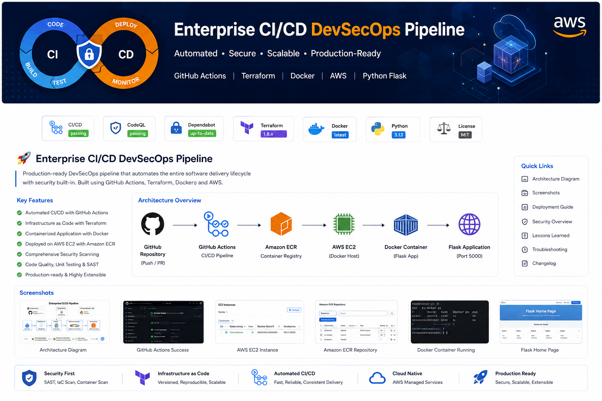
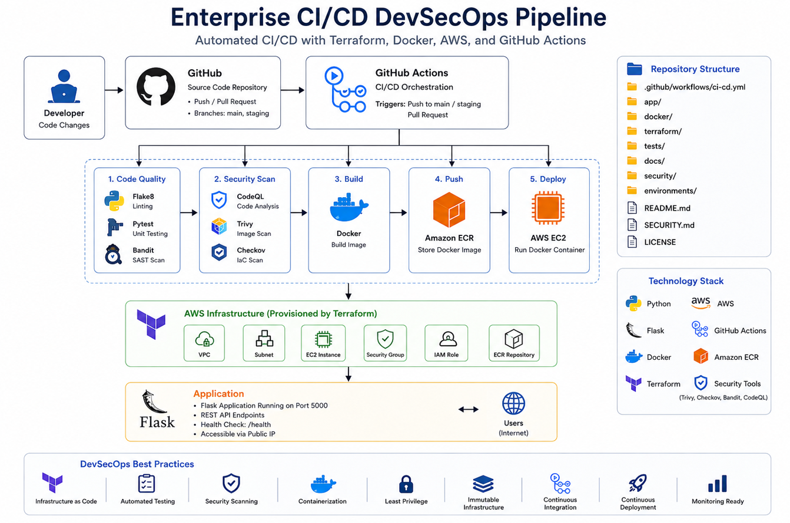
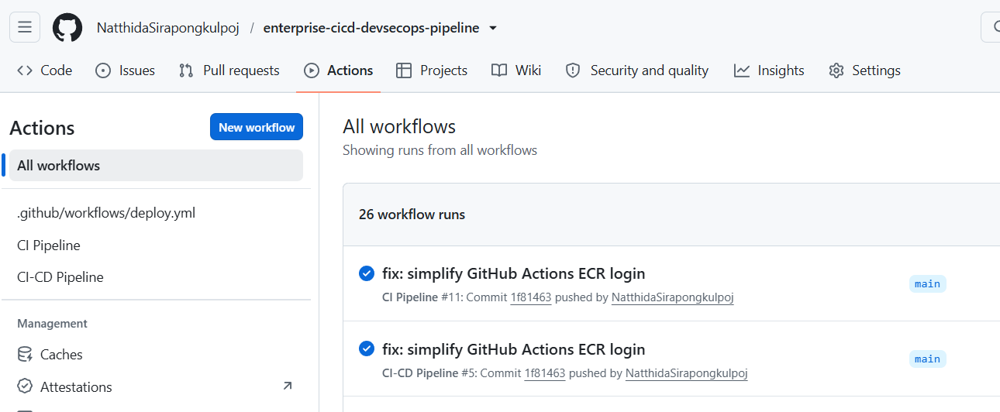
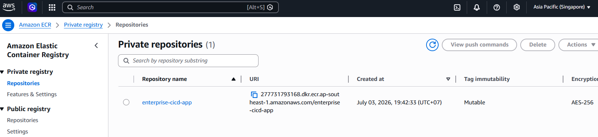
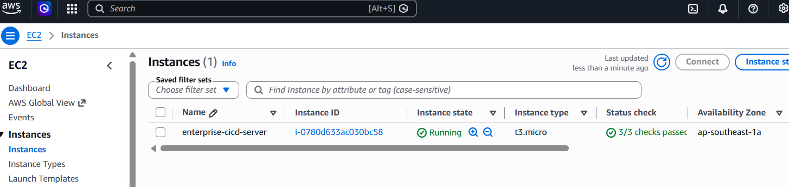
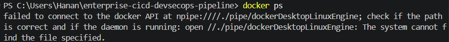
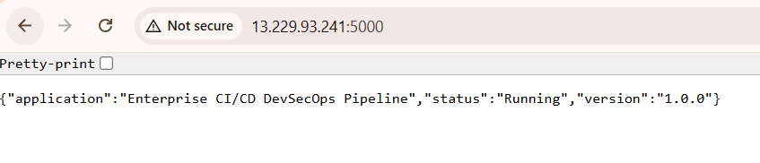
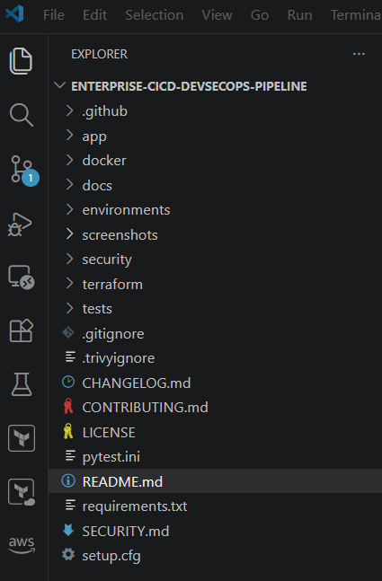

<p align="center">
  
</p>

Production-ready AWS Infrastructure Provisioning and Secure CI/CD Pipeline using Terraform, Docker, GitHub Actions, Amazon ECR and EC2.

</p>

<p align="center">

Designed as an enterprise-grade portfolio project demonstrating Infrastructure as Code (IaC), DevSecOps, automated testing, container security, and cloud deployment following industry best practices.

</p>

---

<p align="center">


</p>

---

# Project Overview

This repository demonstrates a complete **enterprise-style DevSecOps workflow** for deploying containerized applications on AWS using Infrastructure as Code and modern CI/CD automation.

The project focuses on building a secure, repeatable, and automated deployment pipeline that integrates code quality analysis, security scanning, infrastructure validation, Docker image management, and cloud provisioning.

Rather than demonstrating only application development, this repository emphasizes how modern Cloud Engineers and DevOps Engineers automate infrastructure delivery while incorporating security throughout the software delivery lifecycle.

---

# Objectives

This project demonstrates practical experience in:

- Infrastructure as Code (Terraform)
- AWS Cloud Infrastructure
- DevSecOps
- Continuous Integration
- Continuous Delivery
- Docker Containerization
- Secure Cloud Deployment
- GitHub Actions Automation
- Security Scanning
- Cloud Infrastructure Validation

---

# Enterprise Architecture

<p align="center">



</p>

The deployment architecture follows an enterprise DevSecOps model:

```

GitHub Repository

↓

GitHub Actions

↓

Code Quality
• Flake8
• Pytest
• Bandit

↓

Terraform Validation

↓

Checkov IaC Security Scan

↓

Docker Build

↓

Trivy Container Scan

↓

Amazon ECR

↓

Terraform Infrastructure

↓

Amazon EC2

↓

Docker Container

↓

Flask Application

```

Every code change automatically goes through quality assurance, security validation, infrastructure verification, container scanning, and deployment preparation before production delivery.

---

# Key Features

## Infrastructure as Code

- Terraform provisioning
- Modular infrastructure
- Version-controlled cloud resources
- Repeatable deployments

---

## Secure CI/CD Pipeline

- GitHub Actions
- Automated testing
- Security scanning
- Infrastructure validation
- Docker build automation

---

## Containerization

- Dockerized Flask application
- Production Dockerfile
- Lightweight container image
- Consistent runtime environment

---

## Cloud Deployment

- Amazon EC2
- Amazon ECR
- IAM Roles
- Security Groups
- VPC Networking

---

## Security First

Integrated security controls include:

- Bandit (Python SAST)
- Checkov (Terraform IaC)
- Trivy (Container Security)
- Least Privilege IAM
- Infrastructure Validation

Security is integrated into every stage of the deployment pipeline rather than treated as a final deployment step.

---

# DevSecOps Pipeline

This project follows a shift-left security approach.

```

Developer

↓

Git Push

↓

GitHub Actions

↓

Static Code Analysis

↓

Unit Testing

↓

Terraform Validation

↓

Infrastructure Security Scan

↓

Docker Build

↓

Container Vulnerability Scan

↓

Amazon ECR

↓

Production Deployment

```

This workflow ensures infrastructure, application code, and container images are validated before deployment.

---

# Project Highlights

✔ Enterprise-grade GitHub Actions workflow

✔ Infrastructure as Code with Terraform

✔ Automated Docker image build

✔ Amazon ECR integration

✔ EC2 deployment

✔ Flask production application

✔ Integrated security scanning

✔ Container vulnerability analysis

✔ Infrastructure validation

✔ Security-first DevSecOps workflow

---

<!-- ========================================================= -->
<!-- TECHNOLOGY STACK -->
<!-- ========================================================= -->

# Technology Stack

This project combines modern cloud-native technologies to automate infrastructure provisioning, application delivery, and security validation.

| Category | Technology |
|-----------|------------|
| Programming Language | Python 3.13 |
| Web Framework | Flask |
| Cloud Platform | Amazon Web Services (AWS) |
| Infrastructure as Code | Terraform |
| Containerization | Docker |
| Container Registry | Amazon Elastic Container Registry (ECR) |
| Compute | Amazon EC2 |
| CI/CD | GitHub Actions |
| Version Control | Git & GitHub |
| Testing | Pytest |
| Code Quality | Flake8 |
| Static Application Security Testing (SAST) | Bandit |
| Infrastructure Security | Checkov |
| Container Security | Trivy |
| Dependency Management | Dependabot |
| Security Analysis | GitHub CodeQL |

---

# AWS Services Used

| AWS Service | Purpose |
|-------------|---------|
| EC2 | Host Dockerized Flask application |
| ECR | Store versioned Docker images |
| IAM | Secure AWS authentication and permissions |
| Security Groups | Control inbound and outbound network access |
| VPC | Isolated cloud networking |
| Amazon Linux | Container host operating system |

---

# Repository Structure

```text
enterprise-cicd-devsecops-pipeline/

├── .github/
│   ├── workflows/
│   │   └── ci-cd.yml
│   └── dependabot.yml
│
├── app/
│   ├── app.py
│   ├── config.py
│   ├── routes.py
│   └── __init__.py
│
├── docker/
│   ├── Dockerfile
│   └── .dockerignore
│
├── terraform/
│   ├── provider.tf
│   ├── versions.tf
│   ├── variables.tf
│   ├── ec2.tf
│   ├── ecr.tf
│   ├── iam.tf
│   ├── security.tf
│   ├── outputs.tf
│   └── user_data.sh
│
├── security/
│   ├── bandit.yaml
│   ├── checkov.yaml
│   ├── security-policy.md
│   ├── security-summary.md
│   └── overview.md
│
├── tests/
│   └── test_app.py
│
├── environments/
│   ├── dev.env
│   ├── staging.env
│   └── prod.env
│
├── docs/
│   ├── AWS_SETUP.md
│   ├── deployment-guide.md
│   ├── lessons-learned.md
│   ├── cost-estimation.md
│   └── TROUBLESHOOTING.md
│
├── screenshots/
│
├── README.md
├── SECURITY.md
├── CHANGELOG.md
├── CONTRIBUTING.md
├── LICENSE
└── requirements.txt
```

---

# CI/CD Workflow

The GitHub Actions workflow automates the complete software delivery lifecycle from code validation through deployment preparation.

## Stage 1 — Source Control

Every push or pull request automatically triggers the CI/CD pipeline.

```
Developer
      │
      ▼
 Git Push
      │
      ▼
 GitHub Actions
```

---

## Stage 2 — Code Quality

Before infrastructure is validated, application quality is verified.

Tasks include:

- Install dependencies
- Python environment setup
- Flake8 linting
- Pytest execution

This stage prevents low-quality code from entering later deployment stages.

---

## Stage 3 — Static Application Security Testing (SAST)

Application source code is scanned using Bandit.

Bandit identifies common Python security issues such as:

- Hardcoded credentials
- Unsafe subprocess execution
- Weak cryptographic usage
- Insecure file operations

---

## Stage 4 — Infrastructure Validation

Terraform configurations are validated before any deployment activity.

Pipeline tasks:

- terraform init
- terraform fmt
- terraform validate

This guarantees syntactically correct Infrastructure as Code.

---

## Stage 5 — Infrastructure Security

Terraform resources are scanned using Checkov against AWS security best practices.

Typical security checks include:

- IAM policies
- Security Groups
- Encryption settings
- Public exposure
- EC2 configuration
- ECR configuration

Security findings are reported during the pipeline to support secure infrastructure development.

---

## Stage 6 — Container Build

After infrastructure validation succeeds, Docker builds the application image.

The image is based on:

- Python 3.13
- Production Dockerfile
- Lightweight runtime
- Reproducible build process

---

## Stage 7 — Container Vulnerability Scan

The generated Docker image is scanned using Trivy.

The scan checks:

- Operating system packages
- Python packages
- Known CVEs
- Critical vulnerabilities
- High severity vulnerabilities

Only validated container images proceed to deployment.

---

## Stage 8 — Amazon ECR

Validated Docker images are tagged and pushed to Amazon Elastic Container Registry.

Benefits include:

- Versioned container images
- Secure image storage
- Deployment consistency
- Centralized artifact management

---

## Stage 9 — Production Infrastructure

Terraform provisions AWS resources required to host the application.

Provisioned components include:

- Amazon EC2
- Security Groups
- IAM Roles
- Amazon ECR integration

Infrastructure remains fully reproducible using Infrastructure as Code principles.

---

# Security Pipeline

The project adopts a layered DevSecOps strategy where security is integrated throughout the CI/CD lifecycle.

| Security Layer | Tool | Purpose |
|----------------|------|---------|
| Source Code | Flake8 | Code quality |
| Unit Testing | Pytest | Functional validation |
| Static Analysis | Bandit | Python security scanning |
| Infrastructure Validation | Terraform | IaC verification |
| Infrastructure Security | Checkov | AWS best practice checks |
| Container Security | Trivy | Container vulnerability scanning |
| Dependency Updates | Dependabot | Automated dependency management |
| Code Analysis | GitHub CodeQL | Security and code analysis |

This multi-layered approach reduces risk before deployment while encouraging secure software delivery practices.

---

<!-- ========================================================= -->
<!-- DEPLOYMENT -->
<!-- ========================================================= -->

# Deployment Guide

This project follows a fully automated DevSecOps deployment workflow using GitHub Actions, Terraform, Docker, and AWS.

The deployment process ensures application quality, infrastructure consistency, and security validation before container images are published.

---

# Deployment Workflow

```text
Developer

    │

    ▼

Git Push

    │

    ▼

GitHub Actions

    │

    ▼

Python Dependency Installation

    │

    ▼

Flake8

    │

    ▼

Pytest

    │

    ▼

Bandit Security Scan

    │

    ▼

Terraform Validation

    │

    ▼

Checkov Infrastructure Scan

    │

    ▼

Docker Build

    │

    ▼

Trivy Container Scan

    │

    ▼

Amazon Elastic Container Registry

    │

    ▼

Amazon EC2

    │

    ▼

Docker Container

    │

    ▼

Flask Web Application
```

---

# Local Development

Clone the repository

```bash
git clone https://github.com/NatthidaSirapongkulpoj/enterprise-cicd-devsecops-pipeline.git

cd enterprise-cicd-devsecops-pipeline
```

---

Create virtual environment

```bash
python -m venv .venv
```

---

Activate environment

Windows

```powershell
.venv\Scripts\activate
```

Linux / macOS

```bash
source .venv/bin/activate
```

---

Install dependencies

```bash
pip install -r requirements.txt
```

---

Run Flask application

```bash
python app/app.py
```

Application

```
http://localhost:5000
```

---

# Docker

Build image

```bash
docker build -f docker/Dockerfile -t enterprise-cicd-app .
```

Run container

```bash
docker run -d -p 5000:5000 enterprise-cicd-app
```

List running containers

```bash
docker ps
```

Stop container

```bash
docker stop <container-id>
```

---

# Terraform

Initialize

```bash
cd terraform

terraform init
```

Validate

```bash
terraform validate
```

Format

```bash
terraform fmt
```

Plan

```bash
terraform plan
```

Deploy

```bash
terraform apply
```

Destroy

```bash
terraform destroy
```

---

# Security

Security is integrated throughout the software delivery lifecycle.

The repository currently includes multiple security layers.

| Tool | Purpose |
|------|----------|
| Bandit | Python Static Security Analysis |
| Checkov | Infrastructure as Code Security |
| Trivy | Container Vulnerability Scanner |
| GitHub CodeQL | Source Code Security Analysis |
| Dependabot | Dependency Management |

---

## Security Philosophy

This project follows a **Shift-Left Security** approach.

Security validation begins during development rather than after deployment.

Every code change is automatically evaluated before container publication.

---

# Documentation

Additional project documentation is available inside the **docs/** directory.

| Document | Description |
|-----------|-------------|
| AWS_SETUP.md | AWS configuration guide |
| deployment-guide.md | Deployment instructions |
| cost-estimation.md | Estimated AWS monthly cost |
| lessons-learned.md | Project learning outcomes |
| TROUBLESHOOTING.md | Common issues and solutions |

---

# Screenshots

## Enterprise Architecture

<p align="center">


</p>

---

## GitHub Actions Pipeline

<p align="center">



</p>

Automated CI/CD workflow executing quality checks, infrastructure validation, security scanning, Docker image creation, and deployment preparation.

---

## Amazon Elastic Container Registry

<p align="center">



</p>

Private Amazon ECR repository used to store versioned Docker images securely.

---

## Amazon EC2

<p align="center">



</p>

Amazon EC2 instance hosting the production-ready Docker container.

---

## Docker Runtime

<p align="center">



</p>

Running Docker containers inside the EC2 instance.

---

## Flask Application

<p align="center">



</p>

Production Flask application running inside Docker.

---

## Repository Structure

<p align="center">



</p>

Repository organization following Infrastructure as Code and enterprise project standards.

---

# Project Documentation

```

README.md

↓

Architecture Diagram

↓

Terraform Infrastructure

↓

Docker

↓

GitHub Actions

↓

Security

↓

Deployment

↓

Production

```

The repository is structured to resemble enterprise cloud projects, with dedicated directories for infrastructure, security, deployment automation, documentation, testing, and application code.

---

# Project Goals

This repository was built to demonstrate practical skills in:

- Cloud Engineering
- AWS Infrastructure
- Infrastructure as Code
- DevSecOps
- Secure Software Delivery
- CI/CD Automation
- Docker Containerization
- Cloud Security
- Production Deployment
- Enterprise Project Organization

The project reflects modern engineering practices commonly used by cloud teams to automate secure infrastructure provisioning and application delivery.

<!-- ========================================================= -->
<!-- ROADMAP -->
<!-- ========================================================= -->

# Future Roadmap

The current implementation provides a production-ready DevSecOps foundation. Future enhancements will focus on scalability, resiliency, observability, and Kubernetes-based deployments.

| Status | Feature |
|---------|---------|
| ✅ | GitHub Actions CI/CD |
| ✅ | Docker Containerization |
| ✅ | Terraform Infrastructure as Code |
| ✅ | Amazon EC2 Deployment |
| ✅ | Amazon ECR Integration |
| ✅ | Bandit Security Scan |
| ✅ | Checkov IaC Security Scan |
| ✅ | Trivy Container Scan |
| ✅ | GitHub CodeQL |
| ✅ | Dependabot |
| ⏳ | HTTPS with ACM & ALB |
| ⏳ | Auto Scaling Group |
| ⏳ | Application Load Balancer |
| ⏳ | AWS CloudWatch Monitoring |
| ⏳ | SNS Deployment Notifications |
| ⏳ | AWS Secrets Manager |
| ⏳ | SSM Session Manager |
| ⏳ | Blue/Green Deployment |
| ⏳ | ECS Fargate Deployment |
| ⏳ | Kubernetes (Amazon EKS) |
| ⏳ | Multi-Environment Deployment |

---

# Skills Demonstrated

This repository demonstrates practical experience across multiple cloud engineering domains.

## Cloud Engineering

- AWS Infrastructure
- Amazon EC2
- Amazon ECR
- IAM
- VPC Networking
- Security Groups

---

## DevOps

- GitHub Actions
- Continuous Integration
- Continuous Delivery
- Deployment Automation
- Docker
- Git Workflow

---

## DevSecOps

- Shift-Left Security
- Bandit
- Checkov
- Trivy
- CodeQL
- Dependency Management

---

## Infrastructure as Code

- Terraform
- Modular Infrastructure
- Infrastructure Validation
- Version Control
- Reproducible Deployments

---

## Software Engineering

- Python
- Flask
- REST Application
- Unit Testing
- Code Quality
- Package Management

---

# Key Achievements

This project demonstrates an end-to-end enterprise DevSecOps workflow by integrating:

- Production-ready Infrastructure as Code using Terraform
- Automated CI/CD with GitHub Actions
- Secure Docker image build process
- Automated security scanning
- AWS cloud deployment workflow
- Infrastructure validation
- Container vulnerability assessment
- Security-first software delivery
- Documentation following enterprise repository standards

---

# Lessons Learned

Throughout this project I gained practical experience in:

- Designing secure cloud infrastructure
- Building automated CI/CD pipelines
- Managing Infrastructure as Code
- Implementing container security
- Deploying applications using Docker
- Applying DevSecOps best practices
- Automating cloud provisioning
- Troubleshooting GitHub Actions
- Working with AWS services
- Organizing enterprise-scale repositories

---

# Why This Project

Modern cloud engineering extends beyond writing infrastructure code.

This repository demonstrates how infrastructure, application development, security, testing, automation, and deployment work together in a production-oriented environment.

The goal was to build a project that reflects real engineering workflows commonly used across enterprise cloud teams.

---

# Documentation

Additional documentation is available throughout the repository.

| File | Description |
|------|-------------|
| README.md | Project overview |
| SECURITY.md | Security policy |
| CHANGELOG.md | Release history |
| CONTRIBUTING.md | Contribution guide |
| docs/deployment-guide.md | Deployment instructions |
| docs/AWS_SETUP.md | AWS configuration |
| docs/cost-estimation.md | Estimated infrastructure cost |
| docs/TROUBLESHOOTING.md | Common issues |
| docs/lessons-learned.md | Project reflections |

---

# License

This project is distributed under the MIT License.

See the **LICENSE** file for more information.

---

# Repository Statistics

Project Highlights

- Infrastructure as Code
- Production-ready Docker deployment
- AWS Cloud Infrastructure
- Enterprise GitHub Actions pipeline
- Automated security validation
- Container security scanning
- Cloud-native architecture
- Infrastructure automation
- Enterprise documentation
- Cloud engineering portfolio project

---

# About the Author

**Natthida Sirapongkulpoj**

Cloud Engineer • AWS Solutions Architecture Enthusiast

Passionate about designing secure, scalable, and automated cloud infrastructure using Infrastructure as Code and DevSecOps practices.

### Connect

- GitHub: https://github.com/NatthidaSirapongkulpoj
- LinkedIn: https://www.linkedin.com/in/natthidasirapongkulpoj/

---

# Acknowledgements

This project was inspired by engineering practices commonly adopted across modern cloud organizations, emphasizing:

- Infrastructure as Code
- DevSecOps
- Cloud Security
- Automation
- Continuous Improvement

Special thanks to the open-source community and cloud engineering resources that make continuous learning and experimentation possible.

---

<p align="center">

### Enterprise CI/CD DevSecOps Pipeline

Secure • Automated • Scalable • Cloud Native

Built with ❤️ using

**AWS • Terraform • Docker • GitHub Actions • Python • Flask**

</p>
